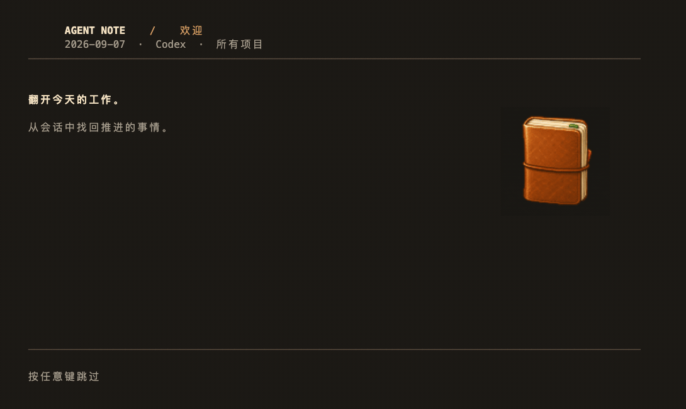

<p align="center">
  
</p>

<h1 align="center">Agent Note CLI</h1>

<p align="center">
  把一天的 AI 编程会话，整理成可回看、可追溯的工作脉络。
</p>

<p align="center">
  <a href="https://github.com/WdBlink/agent-note-cli/actions/workflows/check.yml"></a>
  <a href="https://github.com/WdBlink/agent-note-cli/releases/latest"></a>
  <a href="LICENSE"></a>
</p>

<p align="center">
  <a href="#快速开始">快速开始</a> ·
  <a href="#交互终端">交互终端</a> ·
  <a href="#命令">命令</a> ·
  <a href="docs/usage.md">配置与排错</a> ·
  <a href="docs/backend.md">后端与开发</a>
</p>



这段录屏来自 iTerm2 中的 v0.4.0：展示像素笔记本、首页、工作线、已存深读和返回操作。使用合成会话与预存的测试结果，录屏过程只读、不调用模型。

## 它解决什么

Codex、Claude Code 和 GitHub Copilot CLI 的工作结果通常散落在会话文件里。Agent Note CLI 读取这些本地会话，沿用 Agent Notebook 的 Today 后端，把当天的推进整理成一份能继续阅读的工作脉络。

| 结果 | 你会看到什么 |
| --- | --- |
| **工作脉络** | 按工作线呈现当前停点、可能变化和参与情况 |
| **深读档案** | 对一条工作线展开背景、变化、验证问题和支持证据 |
| **来源入口** | 回到冻结的会话文件、字节范围和哈希校验 |

CLI 不需要 Agent Note 账号或云端服务；结果和恢复状态保存在本机。桌面 App 继续提供更完整的可视化复盘。

## 快速开始

### 1. 安装

macOS 推荐使用 Homebrew：

```sh
brew install wdblink/tap/agent-note-cli
agent-note --version
```

Homebrew 会安装所需的 Node.js，发布包自带锁定的运行时依赖。

### 2. 选择阅读或生成

已有结果，只想本地阅读：

```sh
agent-note ui --read-only
```

生成今天的工作脉络（以 Codex 为例）：

```sh
agent-note brief --source codex
```

生成完成后进入交互终端：

```sh
agent-note ui --source codex
```

首次生成、刷新和首次深读会调用你选择的 provider CLI，并消耗它的模型额度；`--read-only` 永不调用模型。

## 交互终端

直接运行 `agent-note` 或 `agent-note ui`，用键盘沿着工作脉络阅读：

```text
  ▐ AGENT NOTE    /    首页
  ─────────────────────────────────────
  今天，和 Agent 一起推进了什么？

  › 01  工作脉络
        阅读简报，按工作线继续深读
    02  回看日期
    03  选择项目
    04  会话来源
    05  浏览会话原文
    06  使用帮助

  ↑↓/jk 移动  Enter 打开  Esc 返回  q 退出
```

| 场景 | 按键 |
| --- | --- |
| 菜单 | `↑↓` / `j k` 移动，`Enter` 打开，`1–9` 直接选择 |
| 返回与退出 | `Esc` 返回，`q` 或 `Ctrl-C` 退出 |
| 搜索列表 | `/` 输入，`Enter` 筛选，`Esc` 清除 |
| 阅读长文 | `↑↓` 滚动，`Space` / `PageDown` 下翻，`PageUp` 上翻，`Home` / `End` 跳转 |
| 工作线 | `d` 深读，`s` 查看冻结来源，`e` 导出 |
| 生成中 | `Esc` 取消并返回，`q` 或 `Ctrl-C` 取消并退出 |

宽终端会显示选中项预览，窄终端自动切成单列。阅读位置和列表选择会在返回后保留。按 `?` 可在应用内查看完整键位。

图稿默认图片优先：Otty、Ghostty、Kitty、iTerm2 和 WezTerm 使用原生 PNG；未识别图片协议或图片链路不可用时，自动回退到字符像素笔记本。窄窗口保留轻量文字标记。`NO_COLOR=1` 关闭颜色，`TERM=dumb` 或非 TTY 自动使用普通命令模式。v0.5.0 起提供 `--color auto|always|never`。

如果 iTerm2 只显示无颜色文字，先试 `env -u NO_COLOR agent-note ui`，排除从父进程继承的禁色设置。配色与图片协议的区别、窗口要求见[终端显示排错](docs/usage.md#配色和图稿没有出现)。

## 命令

| 想做什么 | 命令 |
| --- | --- |
| 进入交互应用 | `agent-note ui` |
| 看今日工作脉络 | `agent-note brief` |
| 指定来源 | `agent-note brief --source codex` 或 `--source claude` |
| 只读 Copilot CLI 会话 | `agent-note ui --source copilot --read-only` |
| 回看指定日期 | `agent-note brief --date 2026-09-05` |
| 只看当前项目 | `agent-note brief --project "$PWD"` |
| 深读第 1 条工作线 | `agent-note brief --workline 1` |
| 用最新证据重新整理 | `agent-note brief --refresh` |
| 导出 Markdown / JSON | `agent-note brief --format markdown` / `--format json` |
| 查看所有选项 | `agent-note --help` |

这些选项可以组合。深读和刷新时保持相同的 `--source`、`--project`、`--root` 与时区，才能定位到同一份数据范围。

### 一个输出结构示例

下面只展示字段关系，内容是示意文本：

```text
01  结构化 Today 后端
把确定性控制流与模型节点分离。

当前停在：等待 UI 切换。
可能变化（AI 判断，尚未采纳）：Today 可以稳定显示结构化工作线。
你的参与：确定产品方向。
Agent 的参与：完成工程实现。
证据：ready · 会话 session-1
来源：session:codex:session-1
```

脚本模式把进度写入 stderr、结果写入 stdout。退出码为 `0` 正常完成、`1` 参数或运行失败、`2` 结果存在但证据不完整或已过期、`130` 用户中断。

## 来源、数据与隐私

- 默认读取 `~/.codex/sessions`、`~/.codex/archived_sessions`、`~/.claude/projects`；Copilot CLI 会话来自 `~/.copilot/session-state/*/events.jsonl`。
- 原始会话只读。结果和恢复状态默认保存到 `~/.local/share/agent-note`，可用 `--data-dir` 修改。
- `--read-only` 只读取会话和已有结果，不会调用模型；它仍可能创建本地缓存、资产存储和短暂锁目录。
- 生成、刷新或首次深读会把后端选择的会话证据发送给对应 provider；证据可能包含代码、路径、反思或秘密，当前版本不自动脱敏。
- Agent Note 没有自己的遥测服务；provider 的认证、配额和数据政策仍适用。

更多范围筛选、缓存恢复、锁目录和隐私边界见[配置与排错](docs/usage.md)。

## 从源码运行

需要 Node.js 22.16+：

```sh
git clone https://github.com/WdBlink/agent-note-cli.git
cd agent-note-cli
npm ci
npm run build
npm install -g .
agent-note --version
```

不想全局安装时，直接运行 `node src/cli.mjs`；`an` 是 `agent-note` 的短别名。

开发检查：

```sh
npm run check
npm run test:tui
```

检查使用合成会话和模拟模型响应，不能替代真实 provider 的模型质量验收。后端复用关系和发布流程见[后端与开发](docs/backend.md)。

## 更新与卸载

TUI 会在后台检查 GitHub 最新稳定版；失败不影响使用，也不会发送会话或项目内容。设置 `AGENT_NOTE_NO_UPDATE_CHECK=1` 可关闭联网检查，应用不会自行安装更新。

```sh
brew update
brew upgrade wdblink/tap/agent-note-cli
brew uninstall agent-note-cli
```

卸载不会删除本地 brief、恢复数据或 Codex / Claude Code 会话。

## 相关链接

- [配置与排错](docs/usage.md)
- [后端复用与发布流程](docs/backend.md)
- [贡献说明](CONTRIBUTING.md)
- [Issue](https://github.com/WdBlink/agent-note-cli/issues)

MIT © WdBlink · [License](LICENSE)
